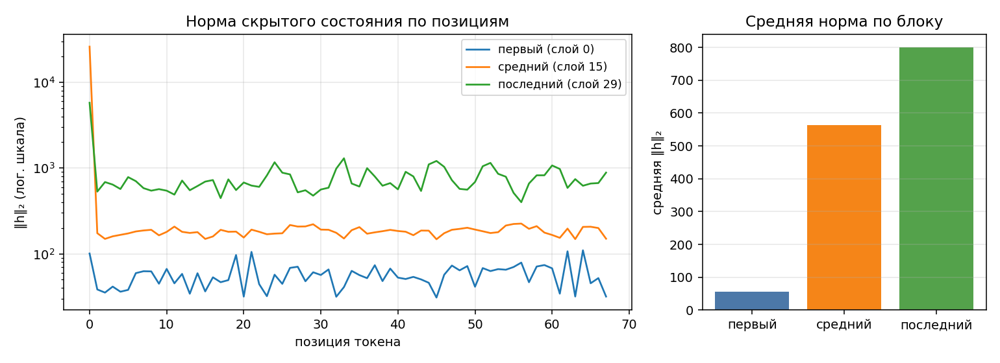

# Анатомия SmolLM2-135M-Instruct

Сгенерировано `make inspect`. dtype `float32`, device `cpu`.

## 1. Конфигурация

| Параметр | Значение |
|---|--:|
| слоёв | 30 |
| hidden_size | 576 |
| intermediate_size | 1536 |
| голов запроса | 9 |
| KV-голов (GQA) | 3 |
| head_dim | 64 |
| словарь | 49 152 |
| tie_word_embeddings | True |

GQA: 9 голов запроса на 3 KV-головы — KV-cache в 3 раза меньше, чем при обычном multi-head.

## 2. Условия замера

| Условие | Значение |
|---|---|
| платформа | macOS-26.5.1-x86_64-i386-64bit (Darwin 25.5.0, x86_64) |
| устройство | `cpu` |
| dtype | `float32` |
| seq_len × batch | 256 × 1 |
| прогонов на режим | 3 |
| память измерена | `ru_maxrss` |
| RSS измерена | `ru_maxrss` |
| дата замера | 2026-09-14T16:29:21+0300 |
| revision модели | 12fd25f77366fa6b3b4b768ec3050bf629380bac |
| seed | 42 |
| потоков torch CPU | 4 |
| use_cache | False во всех режимах |
| gradient checkpointing | выключен |
| python | 3.12.13 |
| torch | 2.2.2 |
| transformers | 4.53.2 |
| peft | 0.14.0 |

Цифры ниже верны только для этих условий. Замер памяти без указания
устройства, dtype, длины последовательности и метрики не воспроизводится
и не сравнивается — поэтому источник метрики стоит отдельной строкой.
Сверьте, что в этой строке названа метрика, уместная для вашего
устройства, и что полученные числа с ней согласуются.

## 3. Параметры по типам модулей

| Группа | Модулей | Shape | Параметров | Доля | Разделяет тензор |
|---|--:|---|--:|--:|--:|
| `embed` | 1 | 49152×576 | 28 311 552 | 21.05% | — |
| `q_proj` | 30 | 576×576 | 9 953 280 | 7.40% | — |
| `k_proj` | 30 | 192×576 | 3 317 760 | 2.47% | — |
| `v_proj` | 30 | 192×576 | 3 317 760 | 2.47% | — |
| `o_proj` | 30 | 576×576 | 9 953 280 | 7.40% | — |
| `gate_proj` | 30 | 1536×576 | 26 542 080 | 19.73% | — |
| `up_proj` | 30 | 1536×576 | 26 542 080 | 19.73% | — |
| `down_proj` | 30 | 576×1536 | 26 542 080 | 19.73% | — |
| `norm` | 61 | 576 | 35 136 | 0.03% | — |
| `lm_head` | 1 | 49152×576 | 0 | 0.00% | 28 311 552 |
| **итого** | | | **134 515 008** | 100% | |

Контроль: `sum(p.numel() for p in model.parameters())` = 134 515 008 — сходится с суммой по таблице.

Обратите внимание на строку `lm_head` и на значение `tie_word_embeddings`
в конфигурации: они связаны, и от этой связи зависит итог таблицы.

## 4. Нормы активаций (forward-hooks)

Промпт: «Объясни, что такое MLOps, в трёх предложениях.», 68 токенов после chat template.

| Блок | Индекс | Средняя ‖h‖₂ | Максимум |
|---|--:|--:|--:|
| первый | 0 | 56.8 | 109.8 |
| средний | 15 | 563.9 | 26077.6 |
| последний | 29 | 800.4 | 5777.4 |

Нормы описывают масштаб скрытых состояний, а не качество ответа. Residual-связь
допускает и рост, и уменьшение нормы. По одним нормам нельзя доказать наличие
attention sink: для этого нужны веса внимания. Логарифмическая шкала позволяет
сравнивать значения разных порядков. В таблице — фактические средние и максимумы.

Прогон с хуками должен быть повторяемым: второй вызов в том же процессе
обязан дать те же числа и не оставить следов на модулях.

## 5. Сколько параметров добавляет LoRA

| Конфиг | Целевых модулей | Своя формула | peft | Совпало | % от базовой |
|---|--:|--:|--:|:-:|--:|
| r=8, q_proj+v_proj | 2 типов | 460 800 | 460 800 | да | 0.343% |
| r=16, все линейные | 7 типов | 4 884 480 | 4 884 480 | да | 3.631% |

Формула: `r * (in_features + out_features)` на каждый целевой `Linear` —
`A` формы `(r, in)`, `B` формы `(out, r)`, смещений нет. Расхождение с
`print_trainable_parameters()` означает ошибку в списке целевых модулей,
а не «разные способы считать».

Доля в таблице считается от базовой модели. `peft` печатает свою долю от
модели ВМЕСТЕ с адаптером, поэтому его процент чуть меньше — числитель
у обоих один и тот же.

## 6. Память в трёх режимах

Один шаг на seq_len=256, batch=1, device=cpu. Метрика — RSS процесса (`ru_maxrss`), пик за прогон; колонка «Пик RSS» снята через `ru_maxrss`.
Вход — случайные id токенов: меряется память, а не качество, и loss здесь
смысловой нагрузки не несёт (у full FT и LoRA он одинаковый, потому что
`B` в адаптере инициализирован нулями и до первого шага ничего не меняет).
Числа должны отличаться: по лекции full fine-tune стоит кратно дороже
инференса, а LoRA лежит между ними.

| Режим | Пик, МиБ | Пик RSS, МиБ | × к инференсу | Секунд | loss |
|---|--:|--:|--:|--:|--:|
| инференс | 1031.9 | 1031.9 | 1.00 | 2.1 | — |
| full fine-tune | 2627.6 | 2627.6 | 2.55 | 4.7 | 12.9889 |
| LoRA (r=8, q/v) | 1241.5 | 1241.5 | 1.20 | 3.4 | 12.9889 |

Все значения памяти приведены в МиБ = 1 048 576 байт (в задании обозначено МБ).
Время включает загрузку модели из локального кэша; step_seconds в JSON — время после загрузки.
На CPU измеряется пик RSS всего дочернего процесса, включая интерпретатор, библиотеки и загрузку.
Каждый режим и повтор запускается в новом процессе. В таблице взят максимальный пик из повторов.

| Режим | Все повторы, МиБ | PID процессов |
|---|---|---|
| inference | [1031.8, 1031.3, 1031.9] | [94203, 94207, 94210] |
| full_ft | [2626.9, 2627.6, 2626.5] | [94223, 94227, 94231] |
| lora | [1241.5, 1240.5, 1239.8] | [94234, 94237, 94267] |

Отдельный подсчёт существующих тензоров (не замена пика RSS):

| Режим | Базовые веса, МиБ | Градиенты после backward, МиБ | AdamW после step, МиБ |
|---|---:|---:|---:|
| inference | 513.134 | 0.000 | 0.000 |
| full_ft | 513.134 | 513.134 | 1026.269 |
| lora | 513.134 | 1.758 | 3.516 |

Базовые веса: 134 515 008 параметров × 4 байта = 513.134 МиБ.
Full FT добавляет к пику инференса 1595.7 МиБ, LoRA — 209.6 МиБ.
В float32 градиенты полного дообучения занимают столько же, сколько веса; два момента AdamW —
примерно вдвое больше плюс скалярные счётчики шагов. Пики отдельных фаз нельзя складывать.
LoRA обучает 460 800 параметров (0.3426%) вместо всех базовых весов.
Это сокращает градиенты и состояния оптимизатора. Базовые веса остаются, добавляются адаптеры
и активации для backward. Поэтому доля обучаемых параметров не равна доле общей памяти.
Разность RSS и подсчитанных тензоров нельзя точно назвать активациями: сюда входят также
буферы операций, память библиотек, загрузки и аллокатора.

На CUDA применяется встроенный счётчик max_memory_allocated после сброса и синхронизации.
На MPS — максимум опросов driver_allocated_memory каждые 10 мс и на границах фаз.
MPS-опрос может пропустить короткую аллокацию, поэтому это оценка пика. Здесь реальные замеры
выполнены только на CPU; маршруты CUDA/MPS проверены тестами с подстановкой API.

## 7. Объяснение результатов и исправленных дефектов

Исследование выполнено на Intel Core i9 (8 физических ядер), MacBook Pro с 16 ГБ RAM.
В условии разрешена SmolLM2-135M-Instruct для ограниченного железа. Используется float32
на CPU: это переносимый вариант для Intel macOS. Готовые пакеты PyTorch для этой
платформы остановились на ветке 2.2; поэтому окружение закреплено отдельно от Linux
и Apple Silicon. Веса загружаются из safetensors, revision модели закреплён в конфиге.

### Архитектура и LoRA

В SmolLM2 30 блоков, hidden_size=576, intermediate_size=1536, 9 Q-голов и 3 KV-головы
по 64 координаты. Поэтому k_proj и v_proj втрое меньше q_proj, а не вдвое, как у Qwen3
на лекции. У SmolLM2 61 RMSNorm: 2 × 30 + 1, всего 35 136 параметров.
RoPE не добавляет обучаемых параметров. Attention содержит 26 542 080 параметров
(19,73%), MLP — 79 626 240 (59,20%): отношение равно 3. Embedding занимает
28 311 552 параметра (21,05%) и разделяется с lm_head.

Ручной расчёт адаптеров, независимо от `peft`:

| Проекция | Модулей | in | out | r=8, q/v | r=16, все семь |
|---|---:|---:|---:|---:|---:|
| q_proj | 30 | 576 | 576 | 276 480 | 552 960 |
| k_proj | 30 | 576 | 192 | 0 | 368 640 |
| v_proj | 30 | 576 | 192 | 184 320 | 368 640 |
| o_proj | 30 | 576 | 576 | 0 | 552 960 |
| gate_proj | 30 | 576 | 1536 | 0 | 1 013 760 |
| up_proj | 30 | 576 | 1536 | 0 | 1 013 760 |
| down_proj | 30 | 1536 | 576 | 0 | 1 013 760 |
| **Всего** | | | | **460 800** | **4 884 480** |

На строку применяется `число модулей × r × (in + out)`. Оба итога точно совпадают
с `peft`; доли от базовых 134 515 008 параметров — 0,3426% и 3,6312%.
`lora_alpha` равен 16 и 32 соответственно, bias отсутствует. Название «все линейные»
относится к семи типам проекций блоков из конфига, без выходного lm_head.

### 1. Повторный учёт tied embeddings

**Было:** `named_parameters(remove_duplicate=False)` возвращал оба имени одного
Parameter, но каждая строка получала `tied=False`. Таблица показывала 162 826 560
вместо 134 515 008 параметров: лишние 28 311 552, то есть размер embedding.

**Исправлено:** множество `id(param)` отмечает повторные ссылки. Строка lm_head
сохраняется с настоящим shape, но в уникальную сумму добавляется ноль.

**Подтверждение:** в [исходном прогоне](baseline-check.txt) проверка 1 падает с
указанными числами. После исправления сумма таблицы и `model.parameters()` равна
134 515 008, у lm_head 0 уникальных и 28 311 552 общих параметра.

### 2. Хуки оставались после forward

**Было:** `register_forward_hook` вызывался без сохранения handle и без remove.
Исходная проверка обнаружила 3 оставшихся хука после первого вызова.
Каждый новый вызов добавлял ещё три callback и удерживал их словари.
Сам по себе дублированный наблюдающий хук не обязан менять численные активации,
но увеличивает число вызовов и время жизни объектов.

**Исправлено:** контекстный менеджер сохраняет handles и снимает их в finally.
Перед сохранением норм тензор отделяется от autograd через detach.

**Подтверждение:** проверка 3 делает два реальных forward, сравнивает активации и
подтверждает 0 оставшихся хуков. Отдельный regression test прерывает вычисление
исключением: собственные хуки удаляются, ранее установленный чужой хук сохраняется.

### 3. Снимок вместо пика и общий процесс режимов

**Было:** `PeakMemory.__exit__` читал память только после gc.collect(). Такой снимок
не гарантирует фиксацию временных аллокаций. Дополнительно memory_profile вызывал
measure_mode последовательно в том же процессе. На CPU ru_maxrss уже является
пиковым счётчиком, но не сбрасывается между режимами: исходный запуск получил
inference=1031, full_ft=2647, lora=2647 МиБ. LoRA унаследовала пик полного обучения.

**Исправлено:** каждый режим и каждый повтор запускается через новый Python-процесс.
CPU использует системный high-water mark, CUDA — сбрасываемый пик аллокатора.
На MPS ведётся опрос во время вычисления и чтение после синхронизации на границах
forward, backward и optimizer.step. В отчёт попадает максимум, не последнее значение.

**Подтверждение:** раздел 6 содержит три повтора каждого режима с разными PID.
Проверка 4 проверяет независимость процессов и full FT > LoRA > inference.
Regression test моделирует выделение и освобождение MPS-памяти: 100 → 500 → 200 → 100
байт. Результат обязан остаться 500, а не стать последними 100 байтами.

### 4. RSS ошибочно использовался для ускорителей

**Было:** device_allocated_bytes и device_metric_source игнорировали аргумент device
и всегда возвращали peak_rss. Смена cpu на mps/cuda не меняла используемый источник.

**Исправлено:** CUDA направляется в `torch.cuda.max_memory_allocated(device)`, MPS —
в `torch.mps.driver_allocated_memory()`, CPU — в ru_maxrss (или peak_wset на Windows).
Имя метрики возвращается из той же ветки, которая выполняет измерение.

**Подтверждение:** на этой машине проверка 6 подтверждает CPU/ru_maxrss и пик выше
513,134 МиБ базовых весов. Аппаратные замеры CUDA/MPS здесь не проводились.
Их маршрутизация проверена подстановкой API: тест CUDA возвращает заданные 123 456
байт из счётчика CUDA, тест MPS — 500 байт из последовательности драйвера.
Это проверка кода, а не выданные за реальные замеры ускорителя числа.

### Что показывают активации

Наблюдались блоки 0, 15 и 29. На зафиксированном промпте средние L2-нормы примерно
56,77 → 563,90 → 800,42. Масштаб представления растёт по этим трём точкам.
Максимум среднего блока (около 26 078) намного больше его среднего, поэтому
логарифмическая шкала делает график читаемым. Нормы не измеряют качество модели
и сами по себе не доказывают механизм возникновения выбросов.

### Проверка и ограничения

Исходный make check провалил четыре проверки: параметры, хуки, порядок пиков и
отсутствующий отчёт. Это число проверок, не число найденных программных дефектов.
Окончательный прогон сохранён в [check.txt](check.txt), запись терминала —
[check.cast](check.cast), видео её воспроизведения — [check.mp4](check.mp4).
Регрессионные тесты запускаются `make test` и не скачивают веса.

Числа памяти зависят от ОС, устройства, dtype и длины входа. В этой работе замеры
сделаны в трёх отдельных процессах на режим, выбран максимальный пик.
График, JSON и сводная XLSX относятся к одному запуску make inspect;
make check выполняет новые измерения, поэтому небольшое отличие ожидаемо.
После новых замеров сводную XLSX нужно обновить по новому JSON.

## 8. Источники

- Условие ДЗ2, слайды 1–7; лекция 2, слайды 5–14 (выданные материалы курса).
- [Конфигурация исследованной ревизии SmolLM2](https://huggingface.co/HuggingFaceTB/SmolLM2-135M-Instruct/blob/12fd25f77366fa6b3b4b768ec3050bf629380bac/config.json).
- [Прекращение выпуска PyTorch для Intel macOS](https://dev-discuss.pytorch.org/t/pytorch-macos-x86-builds-deprecation-starting-january-2024/1690).
- [Документация метрики драйвера MPS](https://docs.pytorch.org/docs/stable/generated/torch.mps.driver_allocated_memory.html).
